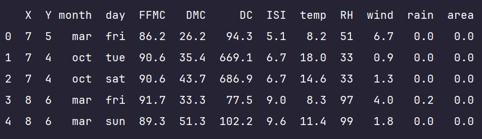
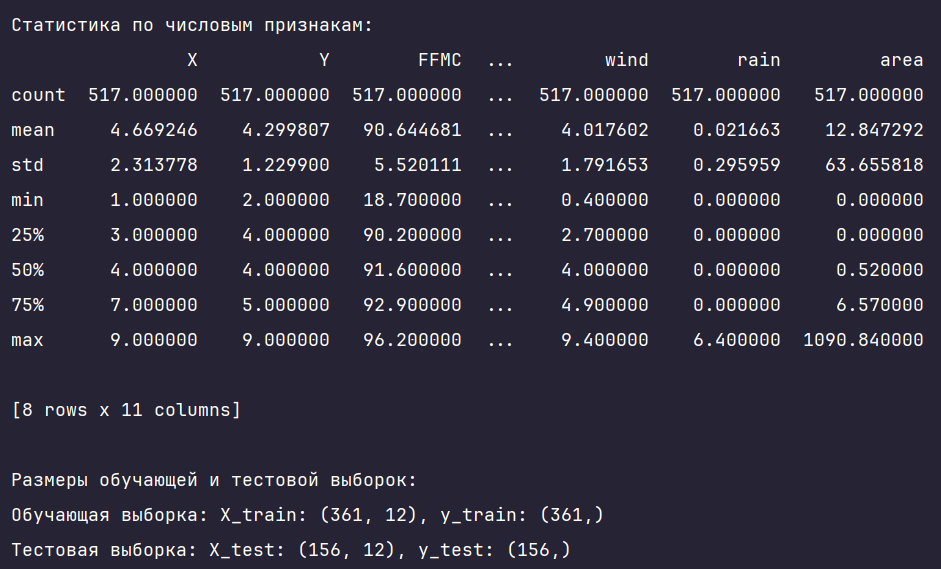
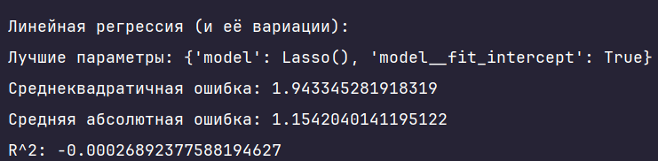
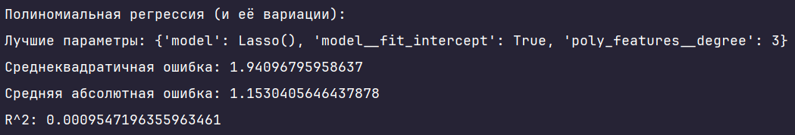
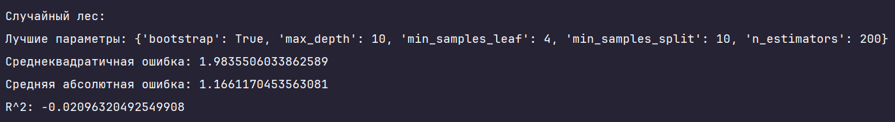
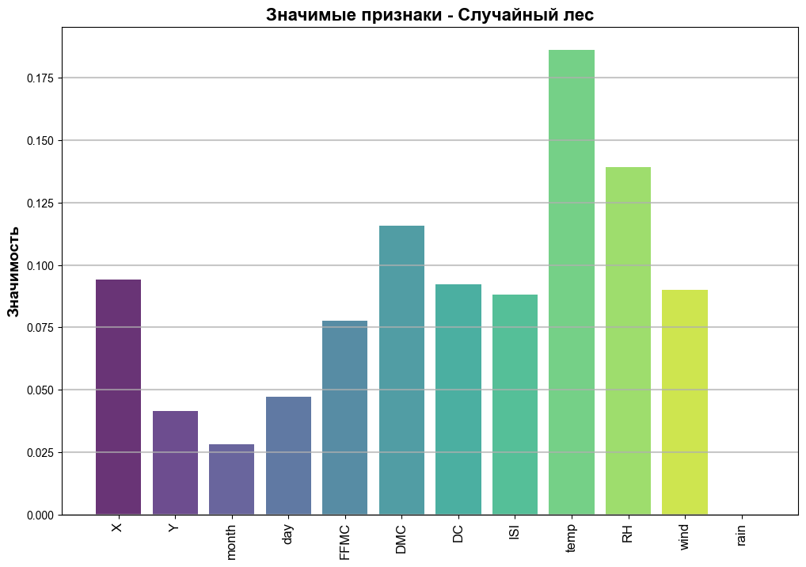
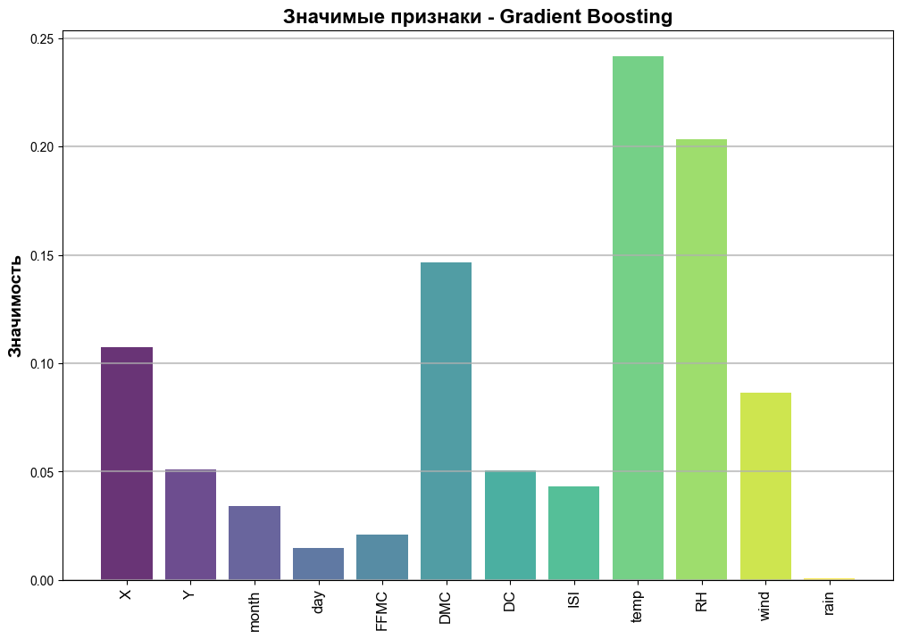

# Регрессия
Этот проект посвящён разработке и анализу регрессионных моделей для прогнозирования площади пожара. В рамках работы были обучены четыре модели на основе следующих алгоритмов:
- Линейная регрессия
- Полиномиальная регрессия
- Случайный лес (Random Forest)
- Gradient Boosting Regressor

Для каждой модели был произведён подбор гиперпараметров с использованием GridSearchCV. По завершении работы модели были сохранены в виде файлов с расширением `.pkl`, что позволяет загружать их в дальнейшем для использования в приложении (чат-боте).

## Функционал
- Предварительная обработка данных и выбор значимых признаков.
- Разделение данных на обучающую и тестовую выборки.
- Обучение моделей и подбор гиперпараметров.
- Оценка качества моделей с использованием коэффициента детерминации \(R^2\), среднеквадратичной ошибки (MSE) и средней абсолютной ошибки (MAE).
- Визуализация значимости признаков для моделей на основе деревьев (Random Forest и Gradient Boosting).
- Сохранение лучшей модели в файл.
- Разработка и интеграция чат-бота на основе Telegram для прогнозирования площади пожара на основе обученной модели.

## Зависимости
Для работы программы необходимы следующие библиотеки:
- `numpy` и `pandas` для обработки данных.
- `scikit-learn` для построения регрессионных моделей и выполнения кросс-валидации.
- `matplotlib` для визуализации значимости признаков.
- `telegram` для разработки и работы чат-бота.

## Установка и запуск проекта
1. Клонируйте репозиторий:
```
git clone https://github.com/Sogato/NNATA-lab3.git
```
2. Создайте виртуальное окружение:
```
python -m venv env
```
3. Установите зависимости проекта:
```
pip install -r requirements.txt
```
4. Создайте .env файл в каталоге проекта и укажите токен бота в Telegram:
```
TELEGRAM_API_TOKEN=YOUR_TELEGRAM_BOT_TOKEN
```
5. Запустите программу:
```
python start_bot.py
```

## Датасет
Датасет содержит информацию о лесных пожарах, включая такие параметры, как температура, влажность, сила ветра и площадь пожара и т.д.

### Описание столбцов:
- **X**: Координата X на карте (целочисленный тип)
- **Y**: Координата Y на карте (целочисленный тип)
- **month**: Месяц наблюдения (строковый тип)
- **day**: День недели наблюдения (строковый тип)
- **FFMC**: Индекс влажности мелкой горючей массы (вещественный тип)
- **DMC**: Индекс влажности мелкой древесины (вещественный тип)
- **DC**: Индекс высыхания (вещественный тип)
- **ISI**: Индекс начальной скорости распространения пожара (вещественный тип)
- **temp**: Температура в градусах Цельсия (вещественный тип)
- **RH**: Относительная влажность воздуха (целочисленный тип)
- **wind**: Скорость ветра в км/ч (вещественный тип)
- **rain**: Количество осадков в мм (вещественный тип)
- **area**: Площадь пожара в гектарах (вещественный тип)

### Первые 5 строк датасета:



### Структура и размер данных:
* Датасет содержит **517** записей и **13** столбцов.
* Числовые признаки (int64, float64): **11**
* Категориальные признаки (object): **2**
### Целевая переменная:
* Целевая переменная (последний столбец, номер 13) изначально имеет большой перекос в сторону 0,0.
* Однако в рамках данной задачи мы используем логарифмическое преобразование с добавлением единицы \(np.log1p\), что помогает сгладить сильный перекос распределения целевой переменной.
### Предварительная обработка:
* Категориальные признаки **month** и **day** кодируются в числовые значения на основе их порядка с использованием OrdinalEncoder. (Например, jan может быть закодирован как 0, feb как 1, и так далее. Для дней недели также будет присвоен порядковый номер)
* Признаки были масштабированы с использованием стандартизации.
* Данные разделены на обучающую и тестовую выборки в соотношении **70%** на **30%**.
* Обучающая выборка содержит **361** записей с **12** признаками (колонки без целевой переменной).
* Тестовая выборка содержит **156** записи с тем же количеством признаков.



## Обучение моделей

### 1. Линейная регрессия



#### Параметры
Для обучения линейной модели были использованы три алгоритма:
- `LinearRegression`: Обычная линейная регрессия без регуляризации.
- `Lasso`: Линейная регрессия с L1-регуляризацией, которая добавляет штраф за сумму абсолютных значений коэффициентов.
- `Ridge`: Линейная регрессия с L2-регуляризацией, которая добавляет штраф за сумму квадратов коэффициентов.

Для каждой из моделей были настроены следующие параметры:
- `fit_intercept`: Определяет, следует ли включать свободный член (пересечение) в модель. (`True` или `False`)

#### Лучшая модель
- **Лучшие параметры:** `{'model': Lasso(), 'model__fit_intercept': True}`

#### Результаты
- **Среднеквадратичная ошибка (MSE):** `1.943`
- **Средняя абсолютная ошибка (MAE):** `1.154`
- **Коэффициент детерминации (R^2):** `-0.0003`

**Вывод:** Из всех трёх методов, **Lasso** показал лучшие результаты в сравнении с **LinearRegression** и **Ridge**. Однако, все три модели продемонстрировали низкое качество предсказания.

### 2. Полиномиальная регрессия



#### Параметры
Полиномиальная регрессия была реализована с использованием трёх моделей:
- `LinearRegression`: Обычная линейная регрессия без регуляризации.
- `Lasso`: Полиномиальная регрессия с L1-регуляризацией.
- `Ridge`: Полиномиальная регрессия с L2-регуляризацией.

Дополнительно были настроены параметры:
- `degree`: Степень полинома, которая определяет степень взаимодействий признаков. (`2`, `3` и т.д.)
- `fit_intercept`: Включение свободного члена в модель.

#### Лучшая модель
- **Лучшие параметры:** `{'model': Lasso(), 'model__fit_intercept': True, 'poly_features__degree': 3}`
- **Степень полинома (degree):** `3`

#### Результаты
- **Среднеквадратичная ошибка (MSE):** `1.941`
- **Средняя абсолютная ошибка (MAE):** `1.153`
- **Коэффициент детерминации (R^2):** `0.001`

**Вывод:** Среди всех моделей полиномиальной регрессии, **Lasso** с кубическими признаками (degree 3) продемонстрировала лучшие результаты, хотя улучшение по сравнению с обычной линейной регрессией было минимальным.

### 3. Случайный лес (Random Forest)



#### Параметры
Для обучения модели случайного леса были настроены следующие гиперпараметры:
- `n_estimators`: Количество деревьев в лесу. (`100`, `200`, `300`)
- `max_depth`: Максимальная глубина деревьев. (`None`, `10`, `20`)
- `min_samples_split`: Минимальное количество образцов для разбиения узла. (`2`, `5`, `10`)
- `min_samples_leaf`: Минимальное количество образцов в листовом узле. (`1`, `2`, `4`)
- `bootstrap`: Использование выборки с возвращением при обучении деревьев. (`True` или `False`)

#### Лучшая модель
- **Лучшие параметры:** `{'bootstrap': True, 'max_depth': 10, 'min_samples_leaf': 4, 'min_samples_split': 10, 'n_estimators': 200}`
- **Количество деревьев (n_estimators):** `200`
- **Максимальная глубина деревьев (max_depth):** `10`
- **Минимальное количество образцов для разбиения узла (min_samples_split):** `10`
- **Минимальное количество образцов в листовом узле (min_samples_leaf):** `4`
- **Использование бутстрапа (bootstrap):** `True`

#### Результаты
- **Среднеквадратичная ошибка (MSE):** `1.984`
- **Средняя абсолютная ошибка (MAE):** `1.166`
- **Коэффициент детерминации (R^2):** `-0.021`

**Вывод:** Модель случайного леса показала худшие результаты среди всех моделей, что может быть связано с переобучением на определённые признаки или недостаточной глубиной деревьев. Несмотря на это, модель продемонстрировала адекватную важность признаков, которая была визуализирована.



### 4. Gradient Boosting Regressor


#### Параметры
Для обучения модели Gradient Boosting Regressor использовались следующие гиперпараметры:
- `n_estimators`: Количество деревьев. (`100`, `200`)
- `learning_rate`: Темп обучения, контролирующий влияние каждого дерева. (`0.01`, `0.1`, `0.2`)
- `max_depth`: Максимальная глубина деревьев. (`3`, `5`)
- `min_samples_split`: Минимальное количество образцов для разбиения узла. (`2`, `5`, `10`)
- `min_samples_leaf`: Минимальное количество образцов в листовом узле. (`1`, `2`, `4`)
- `subsample`: Доля выборки, используемой для обучения каждого дерева. (`0.8`, `1.0`)

#### Лучшая модель
- **Лучшие параметры:** `{'learning_rate': 0.01, 'max_depth': 3, 'min_samples_leaf': 1, 'min_samples_split': 10, 'n_estimators': 100, 'subsample': 0.8}`
- **Количество деревьев (n_estimators):** `100`
- **Темп обучения (learning_rate):** `0.01`
- **Максимальная глубина деревьев (max_depth):** `3`
- **Минимальное количество образцов для разбиения узла (min_samples_split):** `10`
- **Минимальное количество образцов в листовом узле (min_samples_leaf):** `1`
- **Доля выборки (subsample):** `0.8`

#### Результаты
- **Среднеквадратичная ошибка (MSE):** `1.912`
- **Средняя абсолютная ошибка (MAE):** `1.144`
- **Коэффициент детерминации (R^2):** `0.016`

**Вывод:** Gradient Boosting Regressor показал лучшие результаты среди всех моделей. Значение R^2 указывает на то, что модель объясняет 1.6% вариативности данных, что, несмотря на малый процент, является наилучшим результатом в данной задаче.



### Лучшая модель
На основе оценки качества моделей (MSE, MAE и R^2), **Gradient Boosting Regressor** является лучшей моделью для данной задачи. Эта модель продемонстрировала наименьшую среднеквадратичную и среднюю абсолютную ошибку, а также наибольшее значение коэффициента детерминации (R^2), что делает её наилучшим выбором для предсказания площади пожара.

## Чат-бот

В этом проекте реализован чат-бот на платформе Telegram, который использует модель **Gradient Boosting Regressor** для предсказания площади пожара на основе введённых пользователем данных. Бот принимает на вход 12 параметров, включая координаты, погодные условия и день недели, и возвращает предсказанную площадь пожара в гектарах.

### Основные функции бота

1. **Запуск и приветственное сообщение**
   - При вводе команды `/start`, бот отправляет приветственное сообщение, объясняющее, как вводить данные для предсказания.
   - Пример приветственного сообщения:
     ```
     Добро пожаловать! Я бот для предсказания площади пожара. Введите данные в формате:
     X, Y, FFMC, DMC, DC, ISI, temp, RH, wind, rain, month, day
     Пример: 7, 5, 90.6, 35.4, 669.1, 6.7, 18.0, 33, 0.9, 0.0, oct, tue
     ```

2. **Обработка пользовательского ввода**
   - Бот принимает текстовые сообщения, содержащие 12 значений, разделённых запятыми. Эти значения включают:
     - `X`, `Y`: Координаты
     - `FFMC`, `DMC`, `DC`, `ISI`: Индексы пожарной опасности
     - `temp`: Температура воздуха
     - `RH`: Влажность воздуха
     - `wind`: Скорость ветра
     - `rain`: Количество осадков
     - `month`: Месяц (в текстовом виде, например, "oct")
     - `day`: День недели (в текстовом виде, например, "tue")

3. **Предобработка данных**
   - Введённые пользователем данные обрабатываются функцией `preprocess_input`:
     - Преобразование числовых значений в формат `numpy array`.
     - Преобразование категориальных признаков (месяц и день недели) в числовой формат с использованием заранее определённых словарей:
       - `MONTH_MAPPING`: Сопоставляет текстовые обозначения месяцев с числовыми значениями (например, 'jan' → 0).
       - `DAY_MAPPING`: Сопоставляет текстовые обозначения дней недели с числовыми значениями (например, 'mon' → 0).
     - Если количество данных или их формат неверны, бот возвращает сообщение об ошибке.

4. **Предсказание площади пожара**
   - Обработанные данные передаются в модель, которая выполняет предсказание с помощью функции `make_prediction`.
   - Результат предсказания представляет собой логарифмическое значение площади пожара, поэтому выполняется обратное преобразование с помощью `np.expm1`, чтобы получить реальную площадь.
   - Бот отправляет пользователю результат предсказания в формате:
     ```
     Предсказанная площадь пожара: X.XX га
     ```

5. **Обработка ошибок**
   - Бот предусматривает обработку возможных ошибок ввода и возвращает пользователю соответствующие сообщения. Например:
     - Если пользователь ввёл неверное количество данных.
     - Если введены некорректные значения месяца или дня недели.
     - Если произошла другая ошибка, бот возвращает общее сообщение об ошибке.

### Демонстрация работы бота


## Заключение

Результаты экспериментов показали низкую точность предсказаний для всех обученных моделей, что может быть связано с несколькими ключевыми причинами:
1. **Слабая корреляция признаков с целевой переменной:** Основные признаки, используемые для предсказания, могут иметь слабую корреляцию с площадью пожара, что снижает способность моделей делать точные предсказания.
2. **Шум в данных:** Данные могут содержать значительное количество шума или выбросов, которые затрудняют моделям выявление устойчивых закономерностей и закономерностей.
3. **Недостаток данных:** Объём доступных данных (517 записей) является недостаточным для надёжного обучения моделей, особенно для сложных моделей, таких как Gradient Boosting или Random Forest, которые требуют большого количества данных для точных предсказаний.

---

Подготовлено в рамках учебного проекта. Все данные взяты из открытых источников и использованы исключительно в образовательных целях.

---
